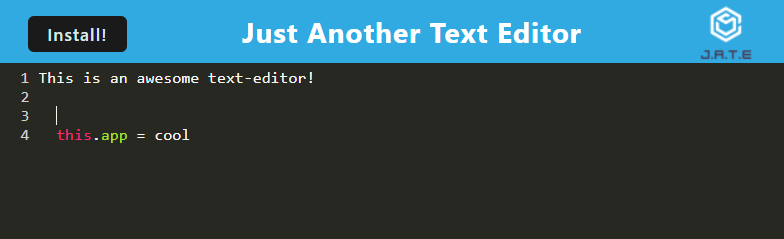

# PWA-Editor

  

  ## Description

  A Progressive Web Application (webpack) using indexedDB - functions as a javascript text editor. Using starter code from University of Richmond Coding Bootcamp.

  ### Deployed Link & Screenshot

  [Deployed Link](https://cryptic-stream-64946.herokuapp.com/)

  

  ## Table of Contents

  - [Installation](#installation)
  - [Credits](#credits)
  - [License](#license)
  - [Questions](#questions)

  ## Installation

  Use `npm i` and `npm run start` to install, build and initialize the server.

  ## Credits

  University of Richmond Coding Bootcamp

  ## License
    
    This project is licensed under the MIT license.

  ## Questions

  - [GitHub User: Kurtmj93](https://github.com/Kurtmj93/)
  - Email: Kurtmj93@gmail.com